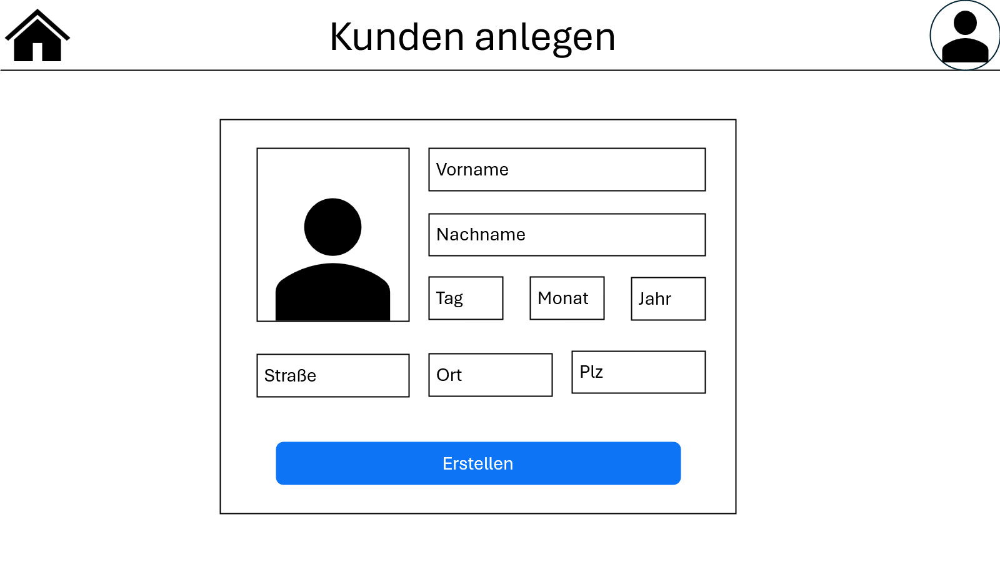
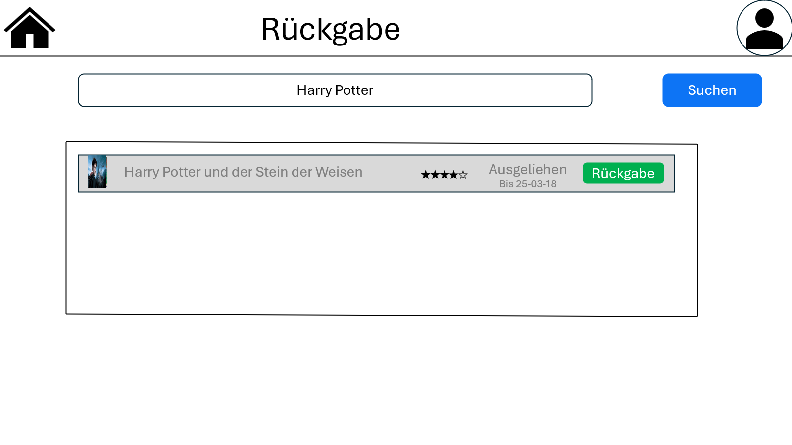

= Wireframe

=== 1. Hauptmenü

image::images/hauptmenu.png[]

1. Ermöglichung der Auswahl von 5 verschiedenen Menüpunkten:
    * Benutzer Anlegen
    * Statistik
    * Verwaltung
    * Ausleihe
    * Rückgabe

=== 2. Kunde Anlegen

1. Ermöglicht das Anlegen eines Kunden
2. Eingabe von Vorname, Nachname, Geburtsdatum, Adresse
3. Bestätigen
4. Jeder Kunde ist mit einem Bibliotheksausweis (Barcode in Wireframe) ausgestattet

=== 3. Verwaltung

image::images/verwaltung2.png[]

1. Ermöglicht das Anlegen, Bearbeiten und Löschen von Büchern für Admins

=== 4. Statistik

image::images/statistik1.png[]

image::images/statistik2.png[]

1. Zeigt die Bücher geordnet nach Beliebtheit an
2. Details zeigt genaueres über die Bücher an

=== 5. Ausleihen

image::images/ausleihen.png[]

1. Ermöglicht das Ausleihen von Büchern für Benutzer

=== 6. Rückgabe

1. Ermöglicht die Rückgabe von ausgeliehene Büchern für Benutzer

== Übersicht

image::images/uebersicht.png[]

