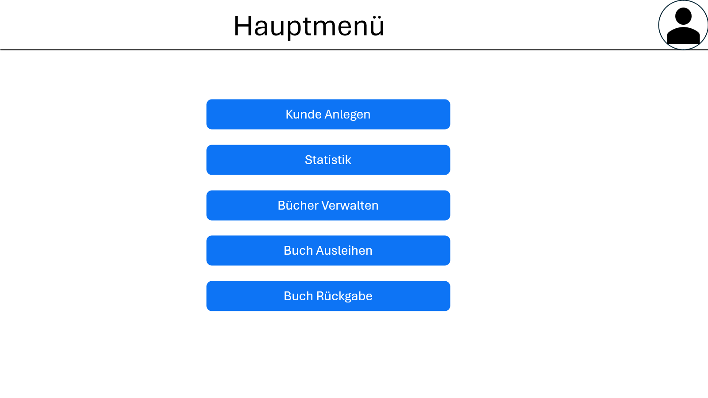
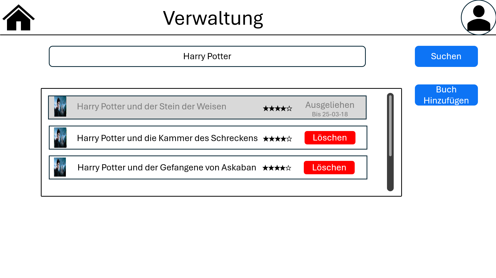
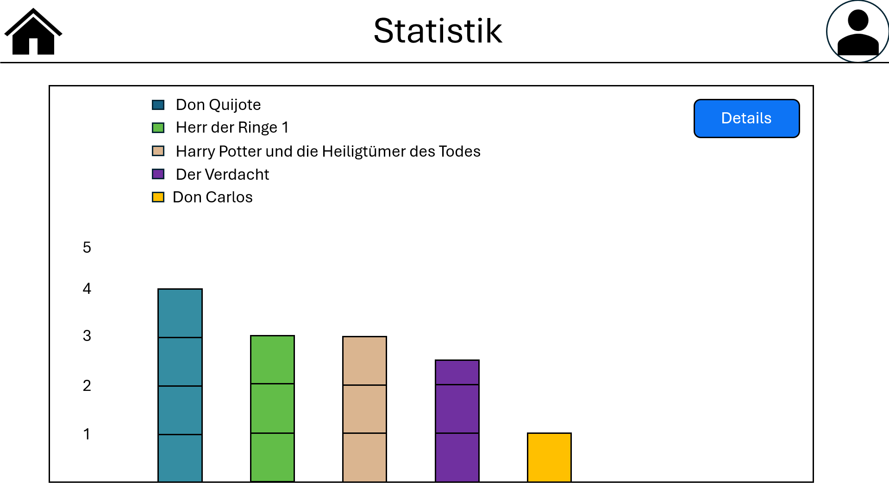
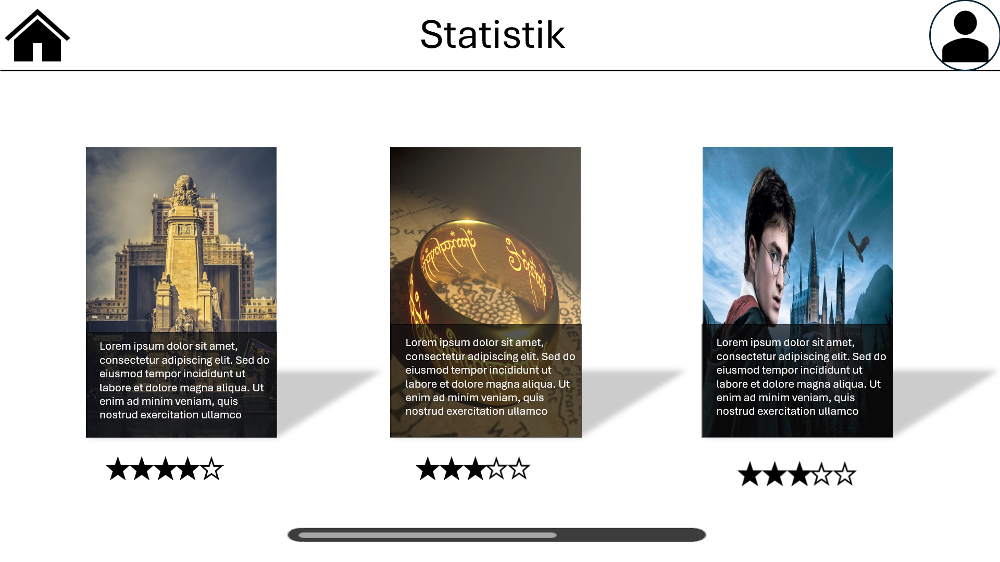
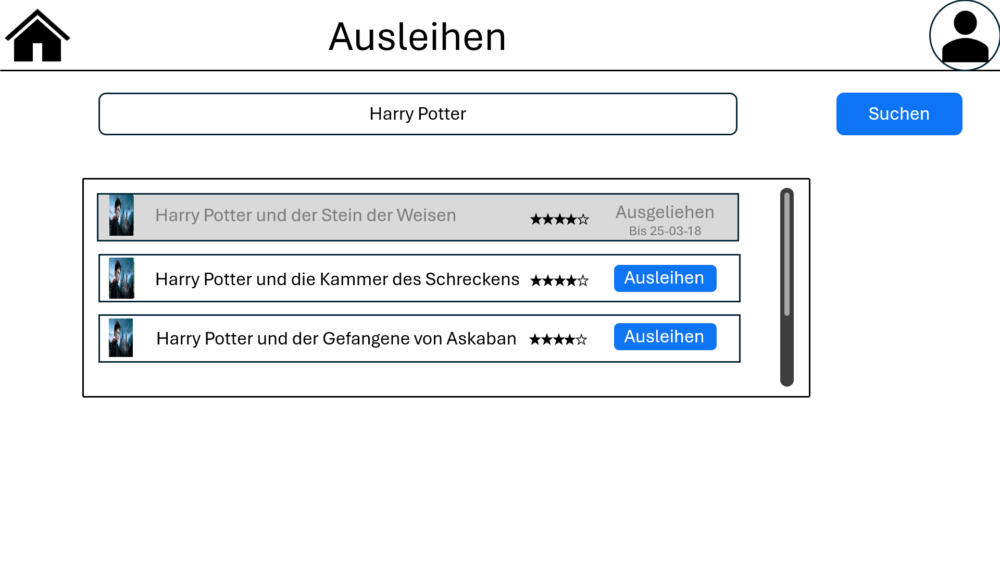
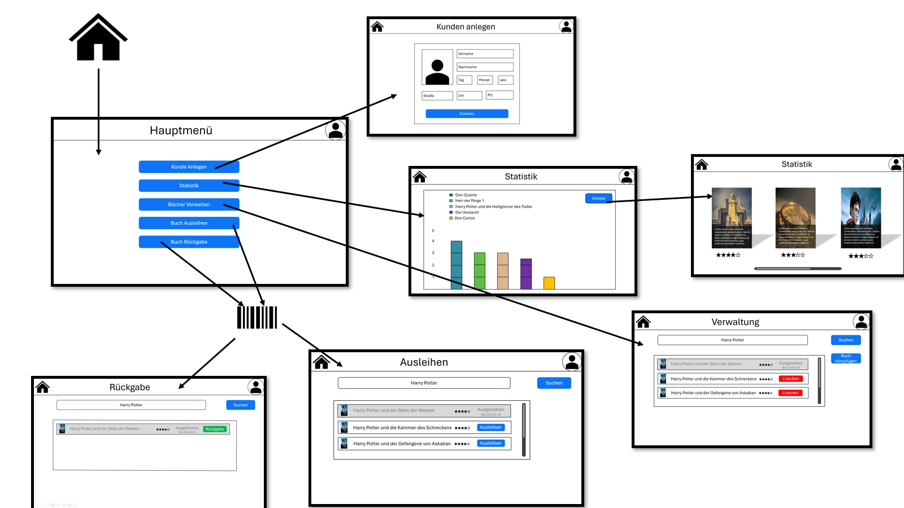

= Wireframe

=== 1. Hauptmenü

1. Ermöglichung der Auswahl von 5 verschiedenen Menüpunkten:
    * Benutzer Anlegen
    * Statistik
    * Verwaltung
    * Ausleihe

=== 2. Benutzer Anlegen

1. Ermöglicht das Anlegen eines neuen Benutzers
2. Eingabe von Vorname, Nachname, Geburtsdatum, Adresse
3. Bestätigen

=== 3. Verwaltung

1. Ermöglicht das Anlegen, Bearbeiten und Löschen von Büchern für Admins

=== 4. Statistik

1. Zeigt die Bücher geordnet nach Beliebtheit an
2. Details zeigt genaueres über die Bücher an

=== 5. Ausleihen

1. Ermöglicht das Ausleihen von Büchern für Benutzer

== Übersicht

